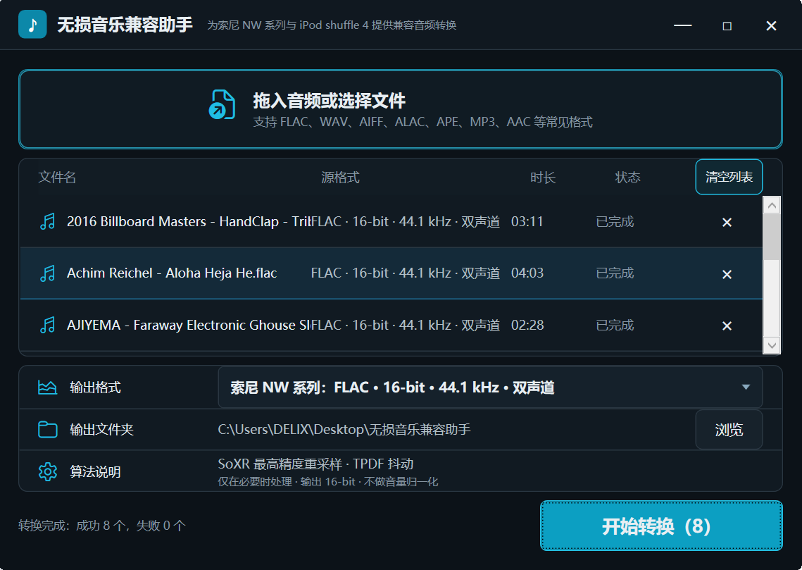

# 无损音乐兼容助手 / Lossless Music Compatibility Assistant



一款面向索尼 NW 系列播放器与 iPod shuffle 4 的 Windows 音频转换工具。
它提供三个设备兼容预设：

```text
索尼 NW 系列：FLAC · 16-bit · 44.1 kHz · 双声道
iPod shuffle 4：ALAC · 16-bit · 44.1 kHz · 双声道
iPod shuffle 4：AAC-LC · 320 kbps · 44.1 kHz · 双声道
```

A Windows audio converter designed for Sony NW series players and the
iPod shuffle 4. It provides three device-compatible output presets:

```text
Sony NW series: FLAC · 16-bit · 44.1 kHz · stereo
iPod shuffle 4: ALAC · 16-bit · 44.1 kHz · stereo
iPod shuffle 4: AAC-LC · 320 kbps · 44.1 kHz · stereo
```

## 功能 / Features

- 批量添加、拖放和移除音频文件。
- 支持 FLAC、WAV、AIFF、ALAC、APE、MP3、AAC、OGG、Opus 等常见格式。
- 默认输出到桌面的“无损音乐兼容助手”文件夹。
- 显示源文件格式、位深、采样率、声道和转换状态。
- 支持转换进度与取消操作。
- 可选择索尼 NW 系列 FLAC、iPod shuffle 4 ALAC 或 AAC 320 kbps。
- 发布为单文件 Windows x64 EXE，内置 .NET 运行时和 FFmpeg。

---

- Batch add, drag-and-drop, and remove audio files.
- Supports common formats including FLAC, WAV, AIFF, ALAC, APE, MP3, AAC,
  OGG, and Opus.
- Outputs to the `无损音乐兼容助手` folder on the desktop by default.
- Shows source format, bit depth, sample rate, channels, and conversion status.
- Provides conversion progress and cancellation.
- Selectable Sony NW FLAC, iPod shuffle 4 ALAC, and AAC 320 kbps presets.
- Publishes as a single Windows x64 EXE with the .NET runtime and FFmpeg
  embedded.

## 音质策略 / Audio Quality Strategy

完全符合所选无损预设的文件会被逐字节复制，不会重新编码。已经兼容的 AAC
M4A 文件也会直接复制，避免重复有损编码。

其他输入采用以下处理链：

1. FFmpeg 高精度解码。
2. libsoxr 最高精度重采样至 44.1 kHz。
3. 在量化到 16-bit 时使用 TPDF 抖动。
4. 使用 FLAC level 8 无损编码。
5. 不进行音量归一化、动态压缩或 EQ。

Files already matching the selected lossless preset are copied byte-for-byte
without re-encoding. Compatible AAC M4A inputs are also copied to avoid
generation loss.

Other inputs use the following pipeline:

1. High-precision decoding through FFmpeg.
2. Highest-precision libsoxr resampling to 44.1 kHz.
3. TPDF dithering when quantizing to 16-bit.
4. Lossless FLAC level 8 encoding.
5. No loudness normalization, dynamic compression, or EQ.

ALAC 使用相同的 16-bit/44.1 kHz 高精度处理链并进行 Apple Lossless 编码。
AAC 预设使用 AAC-LC 320 kbps；AAC 是高质量有损格式，不属于无损转换。

ALAC uses the same high-precision 16-bit/44.1 kHz processing chain followed by
Apple Lossless encoding. The AAC preset uses AAC-LC at 320 kbps; AAC is a
high-quality lossy format and is not a lossless conversion.

为提高老式播放器的兼容性，需要转码的文件只保留第一条音频流和文本元数据，
嵌入式封面等视频流会被移除。已经完全符合目标规格的 FLAC 则原样复制，因此
其中原有的封面和标签不会被改动。

For legacy-player compatibility, transcoded files retain the first audio stream
and text metadata, while embedded cover-art/video streams are removed. FLAC
files that already match the target are copied unchanged, so their existing
artwork and tags remain intact.

> 将有损音频转换为 FLAC 无法恢复已经丢失的信息。采样率或位深发生变化时，
> 严格意义上也不是“无损”，本软件的目标是尽量减少可闻损失并提高老设备兼容性。
>
> Converting lossy audio to FLAC cannot restore discarded information.
> Sample-rate or bit-depth conversion is not mathematically lossless; the goal
> is to minimize audible degradation while maximizing legacy-device
> compatibility.

## 构建 / Build

要求：

- Windows 10/11 x64
- .NET 10 SDK
- 支持 `libsoxr` 的 Windows x64 `ffmpeg.exe`

Requirements:

- Windows 10/11 x64
- .NET 10 SDK
- Windows x64 `ffmpeg.exe` built with `libsoxr`

将 FFmpeg 放到：

```text
Engine/ffmpeg.exe
```

然后执行：

```powershell
dotnet publish -c Release -r win-x64 --self-contained true `
  -p:PublishSingleFile=true `
  -p:IncludeNativeLibrariesForSelfExtract=true `
  -p:PublishTrimmed=false
```

`Engine/ffmpeg.exe` 不提交到 Git。更多信息请参阅
[`Engine/README.md`](Engine/README.md)。

`Engine/ffmpeg.exe` is intentionally excluded from Git. See
[`Engine/README.md`](Engine/README.md) for details.

## 测试 / Tests

回归测试涵盖真实格式识别、目标规格逐字节复制、重采样输出规格、取消清理和
并发写入保护。在 PowerShell 中执行：

Regression tests cover real-format detection, byte-identical target copying,
resampled output specifications, cancellation cleanup, and concurrent-write
protection. Run:

```powershell
powershell -NoProfile -ExecutionPolicy Bypass -File .\scripts\run-tests.ps1
```

## 第三方组件与许可证 / Third-Party Components and Licensing

程序通过独立进程调用 FFmpeg。当前开发构建使用启用了 GPL 组件的 FFmpeg，
公开或商业分发前必须遵守 FFmpeg 及其依赖项的许可证义务。

The application invokes FFmpeg as a separate process. The current development
build uses an FFmpeg binary with GPL components enabled. Public or commercial
redistribution must comply with FFmpeg and all bundled dependency licenses.

详见 / See: [`THIRD_PARTY_NOTICES.txt`](THIRD_PARTY_NOTICES.txt)
